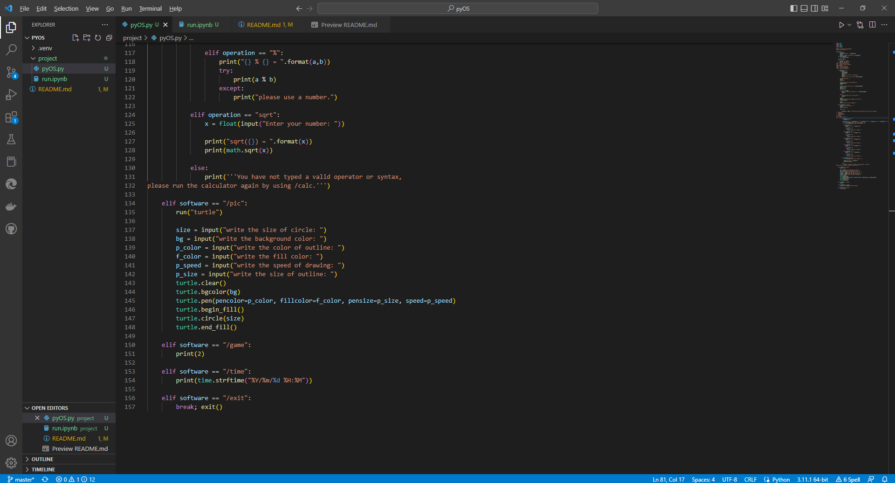

# PyOS : `Py`thon `O`perating `S`ystem

## Intro & Use

>**Before Use** : This is not a real OS, it's just a game for fun.

**Topic** : Mini computer that contains 4 softwares (In latest update):

* `/ai` : Asks about your favorite game and its topic.
* `/calc` : Calculates math operations.
* `/time` : Shows date & time in your local region.
* `/pic` : Draws a shape in `Turtle`.

>**Note** : Type `/exit` to quit the OS.

***

## More info

>**App updates** :

* **1/2/2023** : public release

>**Used libraries** :  

* `turtle` : pics and graphics
* `time` : pauses and time
* `random` : random variables
* `math` : math operations
* `pygame` : coding games

>**Lines of code** :  

* +150 (python)
* +50 (markdown)

>**File types** :  

* `.py` (python)  
* `.ipynb` (jupyter)  
* `.md` (markdown)

>**Used apps** :

* [vs code]('https://vscode.dev') (IDE)
* [python]('https://python.org') (language)
* [github]('https://github.com') (repostory)

***

## OS interface

This is the interface of the **OS**. It's like a basic computer. Before all, it will ask your **username** for better experience.

**Please visit us on :**

* [Discord]('https://discord.gg/jccvsn6baM')
* [Twitter]('https://twitter.com/Yassine_XT8661')
* [Youtube]('https://https://www.youtube.com/channel/UCCun9bwltbZahRLqyU2ce3Q')

***

Made by **Xtreme MC** studios. All rights reserved.
