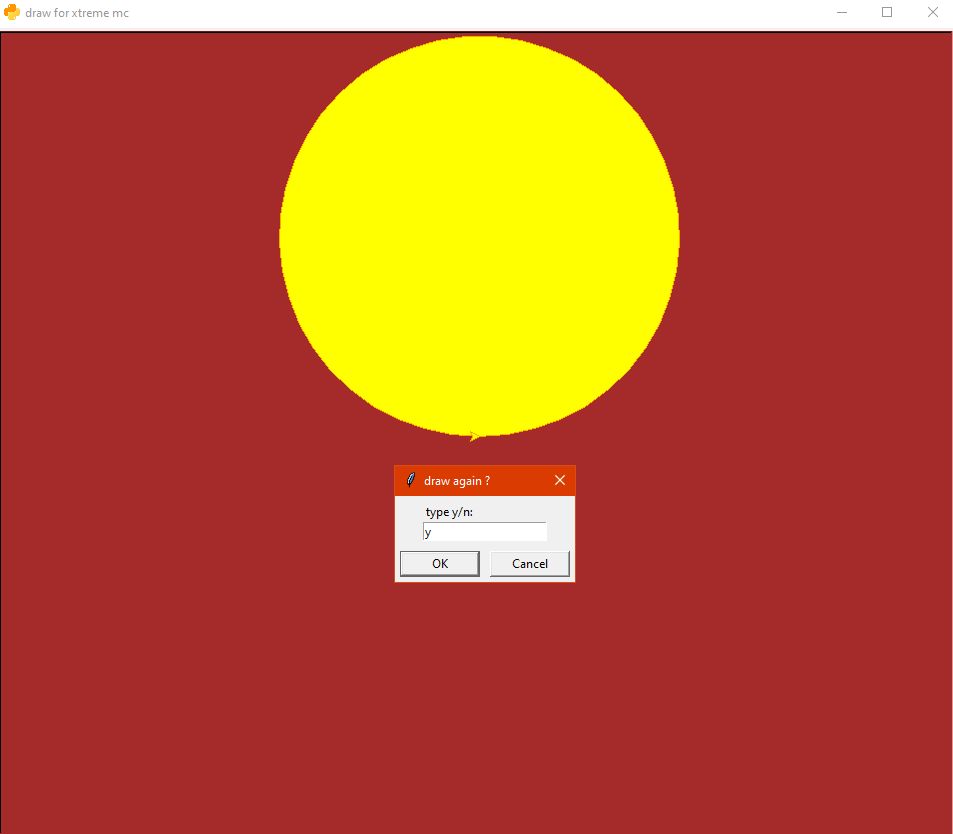

# PyOS : Python Operating System

## Introduction

It's a program containing applications and games. each app or game has its features and uses. The OS will ask for your username to improve your experience in the OS. For now, it have 4 different apps : Calculator, Time, Draw, Guess.

* `/calc` : Calculates math operations.
* `/time` : Shows date & time in your region.
* `/draw` : Draws a selected shape.
* `/guess` : (Coming to the next update.)

**Note** : Type `/exit` to quit the OS.

## Updates

**Note** : Only important updates will be shown here.

> **Latest Version: Alpha 0.2.0**

* Added error message
* Changed "pics" to "draw"
* improved draw
* New game : guess

> **Alpha 0.1.7**  

* improved username
* Removed abs in calculator
* Added pop-up window for time
* Added rectangle to pics

> **Alpha 0.1.3**

* Added username
* Removed Xtreme AI
* New app : pics

> **Alpha 0.1.0**

* Public repostory
* Public Alpha

## How to use

To use the app, copy the [pyOS](.main/pyOS.py) code and paste it into your python editor (IDLE/vscode), Then run it, and save it for later uses. Make sure you use the latest codes for latest updates.


After you runned the code, enter your username to. You can't continue with a blank name. Then, type one of the apps you want. If you want to know all the commands, read the Introduction above, or simply type `/help`. For example, we will type `/calc`.

```pyOS
please input your name to start the OS:

please type a valid name.
please input you name to start the OS: Xtreme MC
Starting...
welcome to pyOS, Xtreme MC.
type /help for help.
/calc
opening calculator for Xtreme MC...
calculator opened successfully.
Please type the math operation: +, -, *, /, sqrt or quit: 
```

Each app has its features. To know how to use an app, follow the instructions. As an example, we will open `/draw` app and try to use it to draw a circle. After drawing the circle, the app prompts to draw again. if you type 'y' it will restart, if not it will close.



## Feedback

If you have any issue or idea, please let us know in [Github]('https://github.com/Sansoun/pyOS').

***

Made by **Xtreme MC** Studios. All rights reserved.
