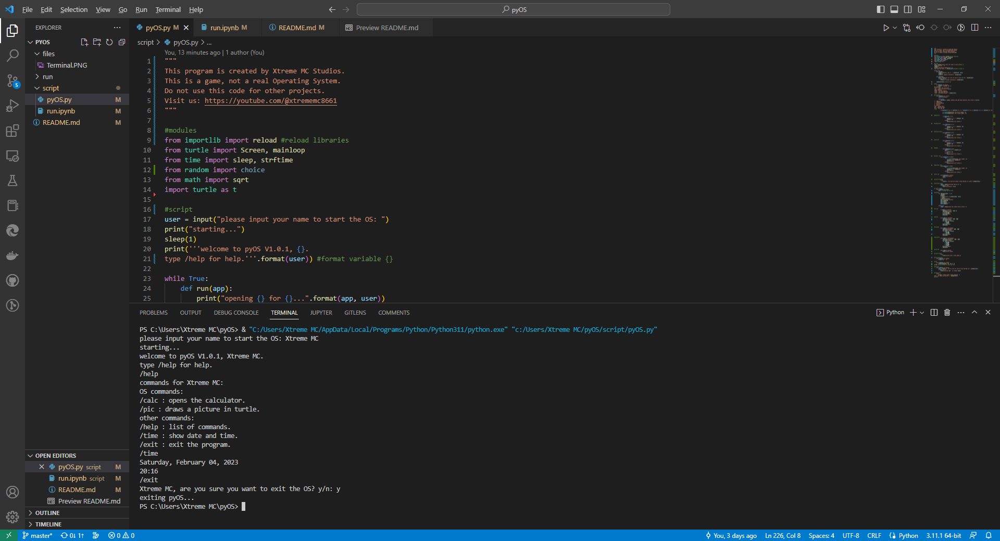

# PyOS : Python Operating System

## Intro & Use

> **Before use**: This is not an OS, it's a simulator.

It's a program containing apps, games, and cmd.\
The OS will ask username to improve your experience.

**Applications and games**:

* `/calc` : Calculates math operations.
* `/time` : Shows date & time in your region.
* `/pic` : Draws a selected shape.
* `/game` : (Coming to the next update).

>**Note** : Type `/exit` to quit the OS.

***

## App updates

**Alpha versions**:

> **Version 0.1.2** (latest)

* fixed issues in turtle
* added pop-up window for time app
* added rectangle to the pics app
* bug fixes and improvements

> **Version 0.1.1**

* added user account
* deleted the Xtreme AI app
* adding more images for pics app
* bug fixes and improvements

> **Version 0.1.0**

* public release
* added first alpha
* added apps to OS

***

## More info

>**Social media :**

* [Discord]('https://discord.gg/jccvsn6baM')
* [Twitter]('https://twitter.com/@Yassine_XT8661')
* [Youtube]('https://youtube.com/@xtrememc8661')

>**Used apps** :

* [vs code]('https://vscode.dev')
* [python]('https://python.org')
* [github]('https://github.com')

>**Source code** :

```python
"""
That's only the start of the source code.
It shows the modules and welcome output.
"""

#modules
from importlib import reload #reload libraries
from time import sleep, strftime #date and time
from random import choice
from math import sqrt
import turtle as t

#script
user = input("please input your name to start the OS: ")
print("starting...")
sleep(1)
print(f'''welcome to pyOS V1.0.1, {user}.
type /help for help.''')
```

***

## OS interface



***

Made by **Xtreme MC** Studios. All rights reserved.
